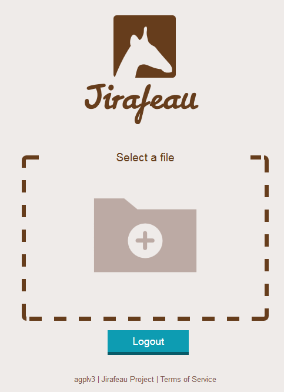

<!--
N.B.: This README was automatically generated by <https://github.com/YunoHost/apps/tree/master/tools/readme_generator>
It shall NOT be edited by hand.
-->

# Jirafeau for YunoHost

[](https://ci-apps.yunohost.org/ci/apps/jirafeau/)


[](https://install-app.yunohost.org/?app=jirafeau)

*[Read this README in other languages.](./ALL_README.md)*

> *This package allows you to install Jirafeau quickly and simply on a YunoHost server.*  
> *If you don't have YunoHost, please consult [the guide](https://yunohost.org/install) to learn how to install it.*

## Overview

Jirafeau offers the possibility to host and share your files with ease. Choose a file, Jirafeau will provide you with a link with many options. It is possible to protect your links with a password as well as to choose how long the file will be kept on the server. The file and the link will self-destruct after this time. Downloads of transmitted files can be limited to a certain date, and each file can self-destruct after the first download. Jirafeau allows you to configure maximum retention times and maximum size per file. Encryption is available as an option.


**Shipped version:** 4.6.0~ynh1

**Demo:** <https://demo.yunohost.org/jirafeau/>

## Screenshots



## Documentation and resources

- Upstream app code repository: <https://gitlab.com/jirafeau/Jirafeau>
- YunoHost Store: <https://apps.yunohost.org/app/jirafeau>
- Report a bug: <https://github.com/YunoHost-Apps/jirafeau_ynh/issues>

## Developer info

Please send your pull request to the [`testing` branch](https://github.com/YunoHost-Apps/jirafeau_ynh/tree/testing).

To try the `testing` branch, please proceed like that:

```bash
sudo yunohost app install https://github.com/YunoHost-Apps/jirafeau_ynh/tree/testing --debug
or
sudo yunohost app upgrade jirafeau -u https://github.com/YunoHost-Apps/jirafeau_ynh/tree/testing --debug
```

**More info regarding app packaging:** <https://yunohost.org/packaging_apps>
